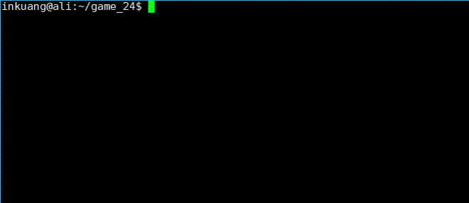

# Game 24

Python 实现的 24 点小游戏

## 使用方法

```shell
git clone https://github.com/inkuang/game_24.git
cd game_24
python3 run.py
```

## 游戏说明

1. 输入 answer 查看当前题目的答案
2. 输入 stop 终止游戏
3. 直接输入算式即可回答题目，若判断无解请输入 nope
4. 除上述描述情况之外的任何输入都是不合法的

## 游戏录屏


